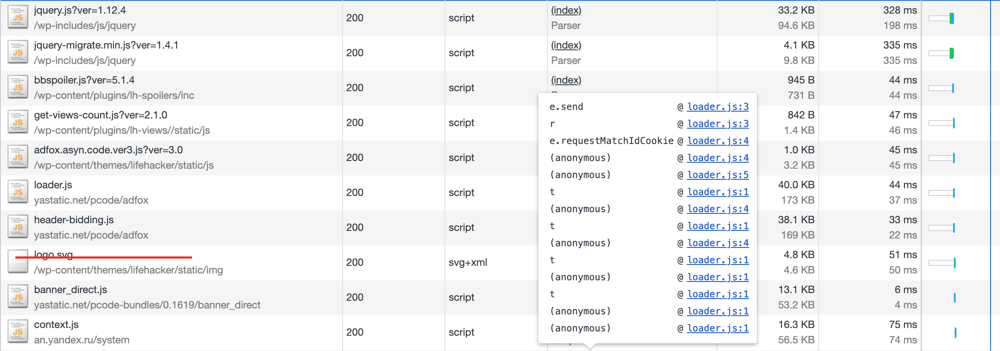

# Анализ сайта lifehacker.ru

## network

- большие изображения
  
- запрос одинаковых ресурсов
  
  
  
  
- блокирующие ресурсы
  
  
  
- шрифты и иконки используются не в полном объеме, но грузятся все
  
  

## Performance

DOMContentLoaded Event 3268.6 ms
Onload Event 6772.9 ms

## Coverage

- css 391 kb unused
- js 1.3 mb
