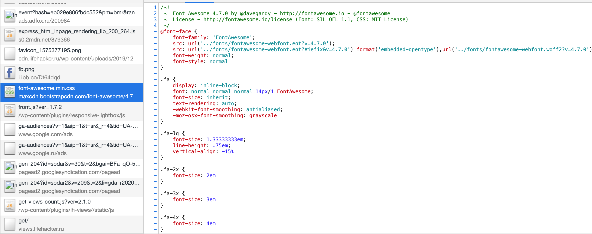

# Анализ сайта lifehacker.ru

## network

- большие изображения
  
- запрос одинаковых ресурсов
  
  
  
  
- блокирующие ресурсы
  
  
  
- шрифты и иконки используются не в полном объеме, но грузятся все
  
  

## Performance

- First Paint - 1092 ms
- First Meaningful Paint - 2454.4 ms
- DOM Content Loaded - 4542.2 ms
- Load - 23035.4 ms

## Coverage

- css 391 kb unused
- js 1.3 mb
